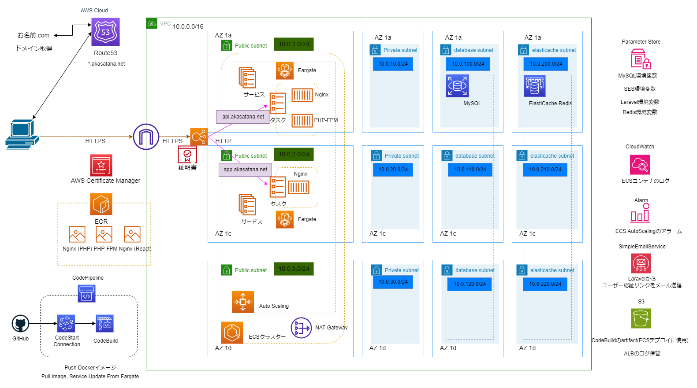

# Laravel と React でシンプル ToDo アプリを作成し ECS へデプロイ

このプロジェクトは以下の Youtube の動画を参考に作成しました

[youtube の WEBOTV / WEB プログラム学習チャンネル](https://www.youtube.com/playlist?list=PL3B2bjwrmhfQkcBEww0gN_kcRAHntAgxG)

## 使用技術

| カテゴリ       | 技術                                                              |
| -------------- | ----------------------------------------------------------------- |
| Frontend       | Nginx, Node.js 16.14.2, TypeScript 4.9.5, React 18.2, Sass 1.69.3 |
| Backend        | Nginx, PHP 8.14, Laravel 10.10                                    |
| Infrastructure | AWS 1.26.4, Terraform 1.6.3                                       |
| Database       | SQLite, MySQL 8.0, Redis                                          |
| Environment    | Docker 20.10.16                                                   |
| Test           | PHPUnit                                                           |
| CI/CD          | CodeBuild, CodePipeline                                           |
| etc            | Git, GitHub, お名前.com                                           |

## インフラ構成図

上記の構成図のリソースは基本的に Terraform で作成

コード管理の都合上、以下リソースは事前に作成する

- AWS の認証

aws profile を利用して、認証情報をコードで管理しないよう注意

- Route53 のホストゾーン

事前にお名前.com で取得済みのドメインと Route53 を紐づける

- ECS のタスク定義で使用する ECR イメージ

始めは、[ecr_push_nginx.sh](./backend/ecr_push_nginx.sh)などのスクリプトを用いて、ECR イメージを Push。リソース作成後は[buildspec.yml](./buildspec.yml)ファイルを用いて ECR イメージを Push

- ECS コンテナの環境変数で使用する ParameterStore

## 懸念点

- Terraform のコードが汚いので修正したい(BestPractice の ThreeLayer で書いてみたい)
- CD によって、ECR コンテナの Image は最新版に Update されるが Terraform コード上では初期の Image のままであり、この差分をどう管理するのが良いのだろう
